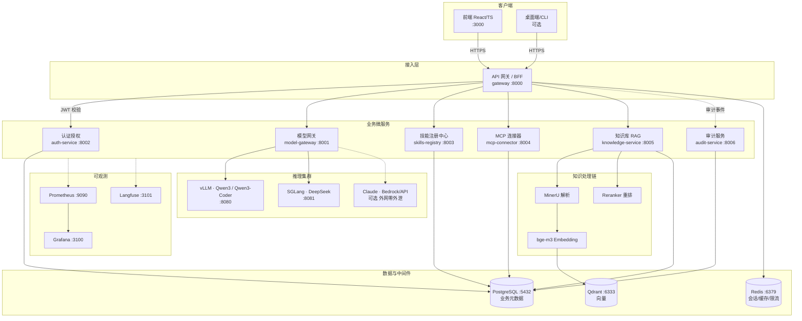
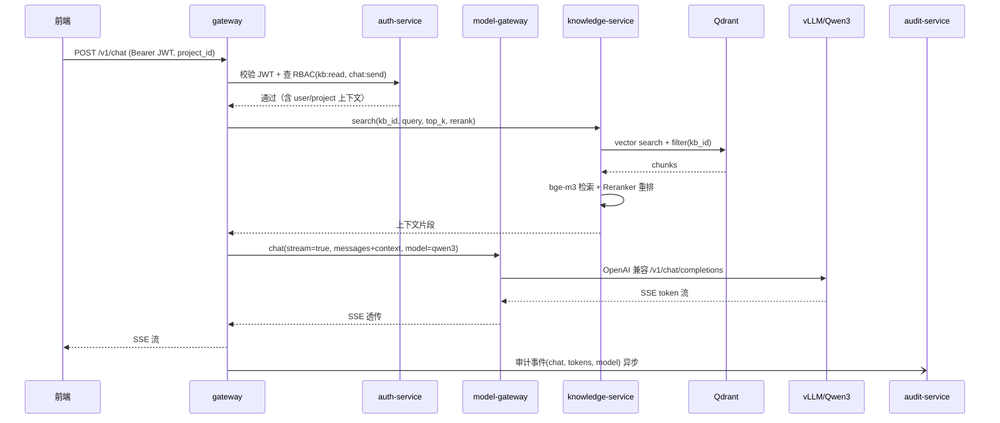

# WorkBuddy Enterprise Edition — MVP 技术架构文档

> 版本：v1.0 · MVP 阶段 1（4 个月 / 2-3 人）
> 定位：企业级本地化部署（私有化）AI 智能体工作台
> 范围：私有化部署包、模型网关、Skills 注册中心、MCP 连接器、企业知识库 RAG、SSO、RBAC、审计日志
> 适用读者：后端 / 前端 / AI(AgentOps) / DevOps 实现团队

---

## 1. 系统总览与部署拓扑

### 1.1 设计原则

1. **数据不出域**：所有推理、向量、业务数据均在客户内网；仅"Claude 经 Bedrock 零外泄通道"属可选商用闭源分支，默认关闭。
2. **模型无关**：上层通过模型网关统一接入 Qwen3（vLLM）/ DeepSeek（SGLang）/ Claude，业务代码不感知具体模型。
3. **薄网关 + 微服务**：API 网关只做鉴权与路由，业务逻辑下沉到各微服务；服务间用 REST（同步）+ 审计事件（异步写入）解耦。
4. **最小闭环优先**：MVP 先跑通"带企业知识的对话"，治理（内容审核、SCIM、等保三级）留到阶段 2，但数据模型与接口预留扩展位。

### 1.2 部署拓扑（Mermaid）



### 1.3 单机端口分配（避免冲突）

| 组件 | 端口 | 说明 |
|---|---|---|
| 前端 (nginx) | 3000 | 生产由 nginx 托管静态产物 |
| gateway | 8000 | 唯一对外入口 |
| model-gateway | 8001 | 内部 |
| auth-service | 8002 | 内部 |
| skills-registry | 8003 | 内部 |
| mcp-connector | 8004 | 内部 |
| knowledge-service | 8005 | 内部 |
| audit-service | 8006 | 内部 |
| PostgreSQL | 5432 | 内部 |
| Qdrant | 6333 / 6334(grpc) | 内部 |
| Redis | 6379 | 内部 |
| vLLM | 8080 | 内部 |
| SGLang | 8081 | 内部 |
| Prometheus | 9090 | 运维 |
| Grafana | 3100 | 运维 |
| Langfuse | 3101 | 运维 |

> 所有 `:800x`、`:808x`、`:5432`、`:6333`、`:6379` 仅监听内网/宿主，不暴露公网；仅 gateway:8000 与 前端:3000 经反向代理对外。

---

## 2. 服务划分

| 服务 | 语言/框架 | 端口 | 职责 | 数据归属 |
|---|---|---|---|---|
| gateway | Python / FastAPI | 8000 | 唯一入口；JWT 校验；路由转发；对话流 SSE 透传；限流；统一错误 | Redis（会话/限流） |
| auth-service | Python / FastAPI | 8002 | OIDC/OAuth2 登录；JWT 签发/校验；用户/角色/权限/项目/团队管理；RBAC 中间件 | users/roles/permissions/projects/teams/experts |
| model-gateway | Python / FastAPI | 8001 | 统一 chat/completions/stream；provider 抽象（vLLM/SGLang/Claude）；API Key 管理与 BYOK；模型路由与回退 | model_providers/model_keys |
| skills-registry | Python / FastAPI | 8003 | 兼容 Anthropic Skills 文件式规范；注册/版本/列表/调用元数据；权限管控 | skills/skill_versions |
| mcp-connector | Python / FastAPI | 8004 | MCP Server 注册与发现；工具清单同步；工具调用中继；凭据托管 | mcp_servers/mcp_tools/mcp_credentials |
| knowledge-service | Python / FastAPI | 8005 | 文档 ingest（MinerU→bge-m3→Qdrant）；检索（vector+rerank）；知识库/文档元数据 | knowledge_bases/documents + Qdrant |
| audit-service | Python / FastAPI | 8006 | 接收调用级审计事件并落库；审计查询；导出 | audit_logs |

> **Agent 编排归属**：MVP 阶段 1 的"对话编排"放在 gateway 内或独立 `agent-runtime`（阶段 2 拆分）。MVP 先由 gateway 调用 model-gateway 并可选地注入 KB 上下文与 Skills/MCP 工具，最小闭环即可。LangGraph 编排在阶段 2 落地；接口已为 `agent-runtime` 预留位置。

---

## 3. 目录结构（monorepo）

```text
enterprise-platform-plan/
├── README.md                      # 项目说明 + 快速启动
├── docker-compose.yml             # 私有化部署包（起步）
├── .env.example                   # 配置样例
├── docs/
│   ├── ARCHITECTURE.md            # 本文
│   └── API_CONTRACT.md            # 服务间 REST 契约
├── deploy/                        # DevOps 部署资产
│   ├── prometheus/
│   │   └── prometheus.yml
│   ├── grafana/
│   │   └── provisioning/datasources/
│   └── vllm/
│       └── serve.sh               # vLLM / SGLang 启动脚本样例
├── src/
│   ├── gateway/                   # API 网关
│   ├── model-gateway/             # 模型网关
│   ├── auth-service/              # 认证授权 + RBAC
│   ├── skills-registry/           # 技能注册中心
│   ├── mcp-connector/             # MCP 连接器
│   ├── knowledge-service/         # 企业知识库 RAG
│   ├── audit-service/             # 审计服务
│   ├── frontend/                  # React/TS 管理控制台
│   └── shared/                    # 跨服务共享（schemas/客户端/公共工具）
│       └── schemas/               # OpenAPI / Pydantic 公共模型
└── (阶段2) agent-runtime/         # 预留：LangGraph 编排
```

每个服务内统一布局：
```text
src/<service>/
├── README.md          # 职责 / 技术栈 / 运行方式
├── requirements.txt   # Python 依赖（或 package.json）
├── Dockerfile         # 由 DevOps 补全
└── app/
    ├── __init__.py
    ├── main.py        # FastAPI app + 健康检查 stub
    ├── api/           # 路由
    ├── core/          # 配置 / db / auth 客户端
    └── services/      # 业务逻辑
```

---

## 4. 数据模型（PostgreSQL 核心表 DDL）

> 单库多 schema 或单 schema 多表均可；下方为单 schema 公开表。服务按"数据归属"列读写各自表，跨服务只读通过 API。
> MVP 用 PostgreSQL；向量单独存 Qdrant。生产可启用行级安全（RLS）做项目隔离双保险。

```sql
-- ============ 认证与 RBAC ============
CREATE TABLE users (
    id              UUID PRIMARY KEY DEFAULT gen_random_uuid(),
    external_id     VARCHAR(128),                 -- OIDC sub / SCIM id（预留）
    username        VARCHAR(128) NOT NULL UNIQUE,
    display_name    VARCHAR(256),
    email           VARCHAR(256) UNIQUE,
    idp             VARCHAR(64) DEFAULT 'local',  -- oidc / local
    status          VARCHAR(16) DEFAULT 'active', -- active / disabled
    created_at      TIMESTAMPTZ DEFAULT now()
);

CREATE TABLE roles (
    id          UUID PRIMARY KEY DEFAULT gen_random_uuid(),
    name        VARCHAR(64) NOT NULL UNIQUE,       -- admin / member / auditor
    description VARCHAR(256),
    builtin     BOOLEAN DEFAULT false
);

CREATE TABLE permissions (
    id          UUID PRIMARY KEY DEFAULT gen_random_uuid(),
    code        VARCHAR(128) NOT NULL UNIQUE,       -- kb:read / skill:invoke ...
    description VARCHAR(256)
);

CREATE TABLE role_permissions (
    role_id       UUID REFERENCES roles(id) ON DELETE CASCADE,
    permission_id UUID REFERENCES permissions(id) ON DELETE CASCADE,
    PRIMARY KEY (role_id, permission_id)
);

-- 用户-角色绑定到"项目"上 → 实现项目级数据隔离
CREATE TABLE user_roles (
    user_id    UUID REFERENCES users(id) ON DELETE CASCADE,
    role_id    UUID REFERENCES roles(id) ON DELETE CASCADE,
    project_id UUID,                                -- NULL=平台级
    PRIMARY KEY (user_id, role_id, project_id)
);

-- ============ 组织资产层（阶段1先建表，阶段2深化）============
CREATE TABLE projects (
    id          UUID PRIMARY KEY DEFAULT gen_random_uuid(),
    name        VARCHAR(128) NOT NULL,
    description VARCHAR(256),
    owner_id    UUID REFERENCES users(id),
    created_at  TIMESTAMPTZ DEFAULT now()
);

CREATE TABLE project_members (
    project_id UUID REFERENCES projects(id) ON DELETE CASCADE,
    user_id    UUID REFERENCES users(id) ON DELETE CASCADE,
    PRIMARY KEY (project_id, user_id)
);

CREATE TABLE teams (
    id          UUID PRIMARY KEY DEFAULT gen_random_uuid(),
    name        VARCHAR(128) NOT NULL,
    project_id  UUID REFERENCES projects(id),
    lead_id     UUID REFERENCES users(id),
    created_at  TIMESTAMPTZ DEFAULT now()
);

CREATE TABLE experts (
    id          UUID PRIMARY KEY DEFAULT gen_random_uuid(),
    name        VARCHAR(128) NOT NULL,
    role        VARCHAR(128),                        -- 专家角色（业务语义）
    description VARCHAR(512),
    project_id  UUID REFERENCES projects(id),        -- 数据隔离键
    owner_id    UUID REFERENCES users(id),
    config_json JSONB,                               -- 提示词/技能/知识绑定
    created_at  TIMESTAMPTZ DEFAULT now()
);

-- ============ 技能 ============
CREATE TABLE skills (
    id          UUID PRIMARY KEY DEFAULT gen_random_uuid(),
    slug        VARCHAR(128) NOT NULL UNIQUE,        -- anthropic skill 目录名
    name        VARCHAR(128) NOT NULL,
    version     VARCHAR(32) DEFAULT '0.1.0',
    description VARCHAR(512),
    manifest    JSONB,                               -- SKILL.md 解析后的元数据
    storage_path TEXT,                               -- 文件式技能存储路径
    project_id  UUID REFERENCES projects(id),        -- NULL=平台共享
    owner_id    UUID REFERENCES users(id),
    is_public   BOOLEAN DEFAULT false,
    created_at  TIMESTAMPTZ DEFAULT now()
);

CREATE TABLE skill_versions (
    id          UUID PRIMARY KEY DEFAULT gen_random_uuid(),
    skill_id    UUID REFERENCES skills(id) ON DELETE CASCADE,
    version     VARCHAR(32) NOT NULL,
    manifest    JSONB,
    created_at  TIMESTAMPTZ DEFAULT now(),
    UNIQUE (skill_id, version)
);

-- ============ MCP 连接器 ============
CREATE TABLE mcp_servers (
    id          UUID PRIMARY KEY DEFAULT gen_random_uuid(),
    name        VARCHAR(128) NOT NULL,
    transport   VARCHAR(16) DEFAULT 'stdio',         -- stdio / sse / http
    endpoint    TEXT,
    command     TEXT,
    project_id  UUID REFERENCES projects(id),
    status      VARCHAR(16) DEFAULT 'active',
    created_at  TIMESTAMPTZ DEFAULT now()
);

CREATE TABLE mcp_tools (
    id          UUID PRIMARY KEY DEFAULT gen_random_uuid(),
    server_id   UUID REFERENCES mcp_servers(id) ON DELETE CASCADE,
    name        VARCHAR(128) NOT NULL,
    schema_json JSONB,
    UNIQUE (server_id, name)
);

CREATE TABLE mcp_credentials (
    id          UUID PRIMARY KEY DEFAULT gen_random_uuid(),
    server_id   UUID REFERENCES mcp_servers(id) ON DELETE CASCADE,
    key         VARCHAR(128),
    secret_ref  TEXT,                                -- 指向密钥管理，明文不落库
    created_at  TIMESTAMPTZ DEFAULT now()
);

-- ============ 模型网关 ============
CREATE TABLE model_providers (
    id          UUID PRIMARY KEY DEFAULT gen_random_uuid(),
    name        VARCHAR(64) NOT NULL,               -- qwen3 / deepseek / claude
    kind        VARCHAR(32) NOT NULL,               -- vllm / sglang / bedrock / api
    base_url    TEXT,
    default_model VARCHAR(128),
    priority    INT DEFAULT 0,
    enabled     BOOLEAN DEFAULT true
);

CREATE TABLE model_keys (
    id            UUID PRIMARY KEY DEFAULT gen_random_uuid(),
    provider_id   UUID REFERENCES model_providers(id) ON DELETE CASCADE,
    label         VARCHAR(128),
    api_key_ref   TEXT,                              -- 密钥管理引用（BYOK）
    scope         VARCHAR(16) DEFAULT 'tenant',     -- tenant / user(BYOK)
    owner_id      UUID REFERENCES users(id),        -- BYOK 时绑定用户
    created_at    TIMESTAMPTZ DEFAULT now()
);

-- ============ 知识库 ============
CREATE TABLE knowledge_bases (
    id          UUID PRIMARY KEY DEFAULT gen_random_uuid(),
    name        VARCHAR(128) NOT NULL,
    project_id  UUID REFERENCES projects(id),        -- 数据隔离键
    embedding   VARCHAR(64) DEFAULT 'bge-m3',
    collection  VARCHAR(128),                        -- Qdrant collection 名
    created_at  TIMESTAMPTZ DEFAULT now()
);

CREATE TABLE documents (
    id          UUID PRIMARY KEY DEFAULT gen_random_uuid(),
    kb_id       UUID REFERENCES knowledge_bases(id) ON DELETE CASCADE,
    title       VARCHAR(256),
    source_path TEXT,
    status      VARCHAR(16) DEFAULT 'pending',       -- pending/parsing/indexed/failed
    chunk_count INT DEFAULT 0,
    meta_json   JSONB,
    created_at  TIMESTAMPTZ DEFAULT now()
);
-- 向量与 chunk 内容存 Qdrant（含 document_id / kb_id payload 供过滤）

-- ============ 审计日志 ============
CREATE TABLE audit_logs (
    id          BIGSERIAL PRIMARY KEY,
    ts          TIMESTAMPTZ DEFAULT now(),
    actor_id    UUID,                                -- 用户
    actor_name  VARCHAR(128),
    project_id  UUID,
    action      VARCHAR(64),                         -- chat / kb.ingest / skill.invoke ...
    resource    VARCHAR(128),
    req_id      UUID,                                -- 关联同一次请求链路
    model       VARCHAR(64),
    tokens_in   INT,
    tokens_out  INT,
    ip          VARCHAR(64),
    detail_json JSONB,
    INDEX (ts), INDEX (actor_id), INDEX (project_id), INDEX (req_id)
);
```

---

## 5. 关键数据流：一次"带企业知识的对话"



要点：
- **鉴权在网关做一次**，下游服务信任网关注入的 `X-User-Id` / `X-Project-Id` 头（内部网络，零信任可选 mTLS）。
- **RAG 在网关编排层聚合**（MVP），阶段 2 移交 `agent-runtime` 用 LangGraph 管理工具调用循环。
- **项目隔离**：KB 检索、专家、技能调用均带 `project_id`，SQL 层强制 WHERE 过滤；平台共享资源 `project_id IS NULL`。
- **审计异步写入**，不阻塞主链路。

---

## 6. 安全模型

### 6.1 SSO（OIDC / OAuth 2.0）
- 企业 IdP（Keycloak / Azure AD / 飞书 / 企微）作为 OIDC Provider。
- 流程：`前端 → gateway(/auth/login?redirect) → auth-service 发起 OIDC 授权码流 → 换 id_token → 签发本平台 JWT（RS256，短期 access + 可选 refresh）`。
- 本地账号兜底（`idp='local'`），便于离线演示。
- SCIM 同步（AD/LDAP）留阶段 2；MVP 支持手动建用户 + 导入。

### 6.2 RBAC
- 权限模型：Permission（细粒度 code）→ Role → User（绑定到 Project）。
- 内置角色：`admin`（平台）、`member`（项目成员）、`auditor`（只读审计）。
- 网关 RBAC 中间件按 `action` 校验；缺权限返回 403。
- 所有写/读接口必须带 `project_id`，实现**项目级数据隔离**。

### 6.3 数据隔离
- 纵向：每资源表带 `project_id`，所有查询强制注入过滤条件（DAO 层统一封装）。
- 横向：PostgreSQL RLS 作为双保险（阶段 2 开启）。
- 向量隔离：Qdrant 按 `kb_id` 分 collection 或 payload 过滤，禁止跨项目检索。

### 6.4 审计
- 调用级审计：`chat` / `kb.ingest` / `skill.invoke` / `mcp.call` / `login` 等。
- 记录：谁、在哪个项目、做什么、用哪个模型、消耗 token、来源 IP、请求 ID（链路关联）。
- 审计写入独立表，仅 `auditor`/`admin` 可查；不可篡改（append-only）。

### 6.5 密钥与 BYOK
- 模型 API Key 不落业务库明文，存密钥管理（Vault / KMS / 文件挂载），DB 仅存引用。
- BYOK：用户自带 Key 绑定 `owner_id`，仅本人及授权项目可用。

### 6.6 等保三级（阶段 2 重点，MVP 预留）
- 传输 TLS、存储加密、日志留存 ≥6 个月、身份鉴别双因子（预留 MFA）、集中审计。MVP 先落实 JWT+RBAC+审计+内网隔离。

---

## 7. 技术风险与缓解

| 风险 | 等级 | 缓解 |
|---|---|---|
| 开源模型能力弱于闭源 | 中 | 模型网关抽象，BYOK 接 Claude 给高净值客户；Qwen3 做主力 |
| RAG 召回质量不足 | 中 | bge-m3 + Reranker + chunk 策略可调；阶段 2 引入重排/查询改写 |
| GPU 资源与成本 | 高 | vLLM 连续批处理 + FP8；轻量任务路由 Qwen3-32B；按项目配额限流 |
| 服务间耦合/鉴权漏洞 | 中 | 网关统一鉴权 + 内部头信任；阶段 2 mTLS 零信任 |
| 私有化部署复杂度 | 中 | Docker Compose 起步；配置模板化；阶段 2 迁 K8s+Helm |
| 数据跨项目泄露 | 高 | project_id 强过滤 + RLS 双保险 + 向量隔离；DAO 层统一封装 |
| 审计性能影响主链路 | 低 | 异步写入（消息/后台任务），不阻塞响应 |
| 技能/MCP 生态兼容性 | 中 | 严格兼容 Anthropic Skills 与 MCP 协议；适配器层隔离差异 |

---

## 8. 落地点与分工边界（明确留给实现团队）

- **架构师（本文）**：服务边界、接口契约、数据模型、部署拓扑。
- **后端团队**：各 `*-service` 的 FastAPI 实现、SQLAlchemy ORM、JWT/RBAC 中间件、DAO 层项目隔离封装。
- **前端团队**：React/TS 控制台（登录/OIDC 回调、仪表盘、知识库/技能/审计页），消费 `API_CONTRACT.md`。
- **AI/AgentOps 团队**：model-gateway 的 provider 适配、RAG 链路（MinerU/bge-m3/rerank）、LangGraph 编排（阶段 2）、Langfuse trace。
- **DevOps 团队**：docker-compose、各服务 Dockerfile、vLLM/SGLang 启动脚本、Prometheus/Grafana/Langfuse 配置、TLS 反向代理。

---

_本文为 MVP 阶段 1 事实来源，后续阶段 2（组织资产层/内容审核/等保）在此基础上扩展。_
